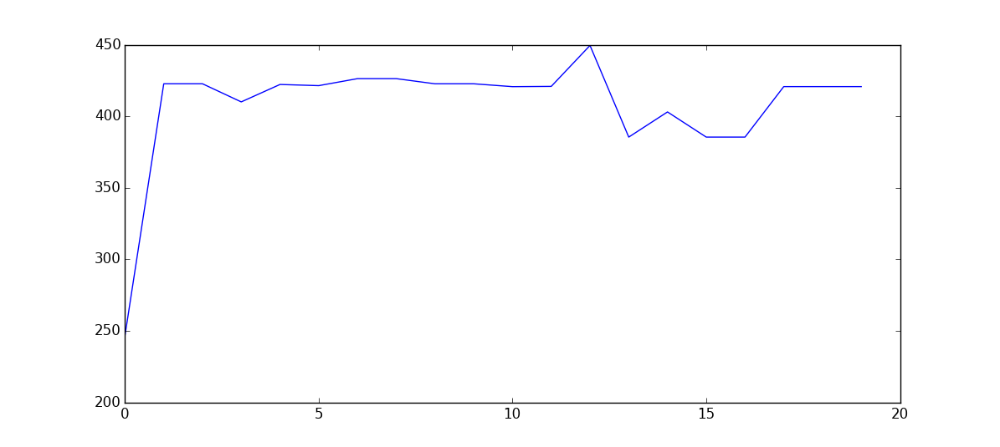

.. _zeromq_monitoring:

=========================
Monitoring a ZeroMQ swarm
=========================

The ZeroMQ swarm is brokered by a Redis server, which contains a list of IP addresses and port numbers associated with any given channel token and hosts the realtime communication channel where nodes advertise when they become connected to or disconected from the network.

Along with the Redis package in most distributions is a commandline utility called `redis-cli` which allows us to query the server.

Observing the progress of the swarm
-----------------------------------

The preferred way of obtaining results from the computation is to use a ZeroMQ island to join the swarm and receive the population by the same mechanism that all of the other peers receive it. The default behaviour of the island is to evolve the population locally, which can be disabled by calling `set_evolve(false)`: this way, the monitoring peer does not consume resources. 

In this example, we'll be monitoring the progress of an archipelago solving the Schwefel problem using differential evolution. The code for our "worker cluster" is the following:

.. code-block:: python

    from PyGMO import *
    import time

    prob = problem.schwefel(10)
    algo = algorithm.de(10)

    zmqisl = zmq_island(algo, prob, 20)
    zmqisl.set_broker_details("127.0.0.1", 6379)
    zmqisl.set_token("schwefel10_de10_pop20")
    zmqisl.set_ip("127.0.0.1")

    archi = archipelago(algo, prob, 3, 20)
    archi.push_back(zmqisl)

    while True:
        archi.evolve(1)
        for isl in archi:
            if isl.get_name().startswith("ZMQ"):
                print(isl.population.champion.x[0])

        time.sleep(1)

We can imagine that this code would be deployed on a supercomputer, or on a remote computing cluster, but for demonstration purposes both programs will be running on the same computer.

Now we'll create a program that instantiates a ZeroMQ island with the same problem, algorithm and population configuration, but that will perform no evolution and will instead display the best individual in the population, as computed by the worker code above. 

.. code-block:: python

    from PyGMO import *
    import matplotlib.pyplot as plt
    import time

    prob = problem.schwefel(10)
    algo = algorithm.de(10)

    isl = zmq_island(algo, prob, 20)
    isl.set_broker_details("127.0.0.1", 6379)
    isl.set_token("schwefel10_de10_pop20")
    isl.set_ip("127.0.0.1")
    isl.set_evolve(False) # Don't evolve, "observer mode"
    isl.connect()

    best_x = []
    for _ in range(20):
        isl.evolve(1)

        # Get best individual from received population
        champion_x = isl.population.champion.x[0]
        best_x.append(champion_x)
        print(champion_x)

        time.sleep(1)

    # Plot consensus value over time
    plt.plot(best_x)
    plt.show()

And the result of running this program is:

Listing peers active on a channel
---------------------------------

.. code-block:: bash

    redis-cli smembers pagmo.islands.<token>

Example:

.. code-block:: bash

    $ redis-cli smembers pagmo.islands.zeromq_test
    1) "192.168.1.39:2286"
    2) "192.168.1.39:1568"
    3) "192.168.1.39:2639"

In this example all three connected islands are running on one machine, but any device that can reach the broker could advertise its IP.

Monitoring control events on a channel
--------------------------------------

.. code-block:: bash

    redis-cli subscribe pagmo.islands.<token>.control

At the moment the only control messages sent are "connected" and "disconnected": the rest of the communication happens directly on the ZeroMQ sockets.

.. code-block:: bash

    $ redis-cli subscribe pagmo.islands.zeromq_test.control
    Reading messages... (press Ctrl-C to quit)
    1) "subscribe"
    2) "pagmo.islands.zeromq_test.control"
    3) (integer) 1
    1) "message"
    2) "pagmo.islands.zeromq_test.control"
    3) "disconnected/192.168.1.39:2639"
    1) "message"
    2) "pagmo.islands.zeromq_test.control"
    3) "connected/192.168.1.39:1905"

In this monitoring session we see two events: 192.168.1.39:2639 disconnects from the swarm and then 192.168.1.39:1905 connects to the swarm.
